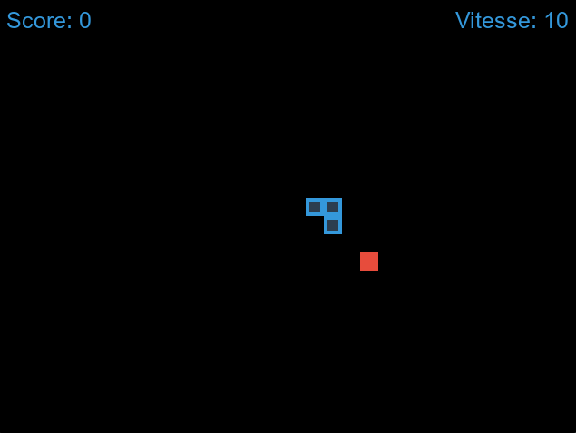

#Import des bibliothèques
pip install -r requirements.txt

#Lancement du projet 
py agent.py

La partie graphique de agent.py permet de mettre en évidence les performances de l'agent au fil du temps dans le jeu

Axe des abscisses (X) :

L'axe des abscisses représente le nombre d'itérations ou d'épisodes d'entraînement effectués par l'agent.
Chaque itération ou épisode correspond à une session d'entraînement complète où l'agent joue plusieurs parties du jeu Snake et met à jour ses stratégies en fonction des récompenses qu'il reçoit.
Axe des ordonnées (Y) :

L'axe des ordonnées représente les performances de l'agent, généralement mesurées par le score obtenu dans le jeu Snake.
Le score est une mesure de la capacité de l'agent à jouer efficacement au jeu, en mangeant des fruits et en évitant les collisions avec les murs ou son propre corps.
Plus le score est élevé, meilleure est la performance de l'agent.
Courbe de score :

La courbe de score montre l'évolution du score de l'agent au cours de l'entraînement.
Au début de l'entraînement, le score peut être faible car l'agent n'a pas encore appris à jouer efficacement au jeu.
Au fur et à mesure que l'entraînement progresse, le score tend à augmenter à mesure que l'agent apprend des stratégies plus efficaces pour jouer au jeu.
La courbe peut montrer des fluctuations en fonction de la variabilité de l'entraînement et des choix aléatoires de l'agent.
Courbe de score moyen :

En plus de la courbe de score individuel, il est courant de tracer également une courbe de score moyen.
Cette courbe représente la moyenne mobile des scores sur un certain nombre d'épisodes d'entraînement.
La courbe de score moyen peut donner une indication plus stable de l'évolution des performances de l'agent, en lissant les fluctuations dues au hasard ou à la variabilité de l'entraînement.
En résumé, la courbe de performance lors de l'entraînement d'un agent d'apprentissage par renforcement représente l'évolution du score de l'agent au fil du temps, fournissant ainsi des informations sur l'efficacité de l'apprentissage et la progression de l'agent dans la maîtrise du jeu.
